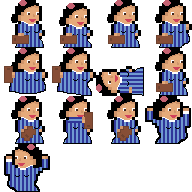

# Revolta Galega
## By: Morriña Games
    
Este proyecto es un trabajo universitario de la **Facultad de Informática de la UCM**. 
Este es un juego de plataformas que se centra en disparar a los demás jugadores y ser el último superviviente. Dos usuarios encarnarán a personajes gallegos y lucharán por ser el último en pie. Quién gane un número de rondas determinadas ganará la partida. El número de rondas se podrá definir previamente (3, 5 o 7). 
*Revolta Galega* es un juego sencillo, rápido y entretenido de jugar perfecto para cualquier jugador en cualquier situación. 
Este juego es perfecto para pasárselo bien con amigos. Mientras otros juegos cuentan con una complejidad que echa para atrás a muchos jugadores, *Revolta Galega* es tanto simple como divertido. La variedad de personajes a elegir del folclore gallego y los mapas de sitios históricos de esta tierra, como la propia Catedral de Santiago, le da una inmersión y arte increíble. Asimismo, gracias a la música clásica gallega de fondo podrás sumergirte en el juego y vivirlo en tus carnes. Es rápido, dinámico y no podrás parar de jugarlo cuando lo pruebes.  

* ### Nada mas entrar en el juego nos encontramos con una página de inicio donde podemos ver con mas detalle la descripción del juego, las instrucciones para jugar y los créditos  
  

* ### Si deslizamos para abajo nos encontraremos con la pantalla del juego la cual, tras darle a *Start*, empezará el juego.  
  

* ### Una vez pulsamos el boton start pasamos a la pantalla de selección de personajes, donde contamos con cuatro personajes elegibles. Estos son Amancio Ortega, Rosalia de Castro, Mariano Rajoy y un irmandinio.  
  

* ### Inmediatamente después encontramos la selección de mapas y rondas, donde podremos elegir entre 4 diferentes, y seleccionar el número de rondas que se quieren jugar.  
  

* ### En pantalla aparecerán 2 personajes en el interior de una catedral con plataformas, dependiendo de los que hayamos elegido previamente.  
### Cada personaje tiene su bala personalizada y una serie de características propias y únicas.   
  

## Amancio Ortega:
  

## Mariano Rajoy:
  

## Rosalia de Castro:
  

## Irmandinio:
  

## Power Ups:
### Cada cierto tiempo unos *Power Ups* caen del cielo. Concederán alguna habilidad especial al jugador que los rompa.
  

* ### Cuando un jugador impacta una bala en otro jugador gana la partida.  
  

------------------------------------------------------------------------------------------------------------------------------------------------------------------------- 

## Enlace a la página web con el juego:
## https://angelhort.github.io/DVI/

### Autores:
* <a href="https://github.com/MigueldeAreba">Miguel de Areba Oliva</a>
* <a href="https://github.com/gavilaneees">David Gavilanes de Dios</a>
* <a href="https://github.com/Tarusito">Pedro José Pérez Vasco</a>
* <a href="https://github.com/angelhort">Ángel Hortelano Pérez</a>

